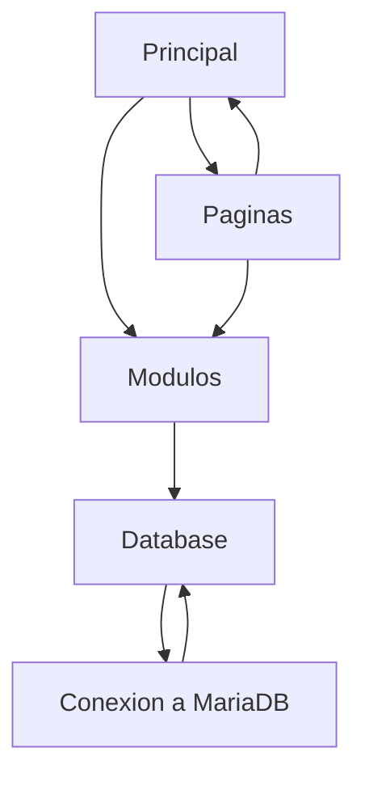

# Skell's ADO

> Este repositorio es una completa reestructuración de mi software "Skell's ADO", al momento de culminarlo se transferirá la propiedad a la organización "Skell's Software"

Este repositorio fue creado con la intención de modificar y reestructurar la aplicación Skell's ADO, desde su funcionalidad hasta su modularidad y versatilidad.

Tambien planeo la posibilidad de implementar ahora el uso de clases para mejorar la usabilidad de los modulos.

## Idea de Reestructuración de Manejo de Datos

## Módulos
- ### Clientes:
    1. Lista de Clientes: Muestra una tabla con todos los clientes y con herramientas de busqueda.
    2. Registrar Cliente: Permite registrar clientes nuevos en el sistema.
    3. Editar Cliente: Permite editar información de un cliente existente.
- ### Inventario:
    1. Lista de Productos: Muestra una tabla con todos los productos y con herramientas de busqueda.
    2. Registrar Producto: Permite registrar productos nuevos en el sistema.
    3. Editar Producto: Permite editar información de un producto existente.
- ### Ventas:
    1. Historial de Ventas: Muestra el historial de ventas del sistema.
    2. Realizar Venta: Permite realizar ventas de forma simplificada y auto registrable en el sistema.
    3. Cuotas Pendientes: Permite manejar las cuotas pendientes de ventas realizadas.